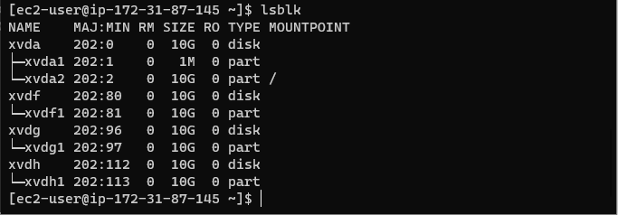
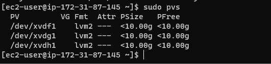
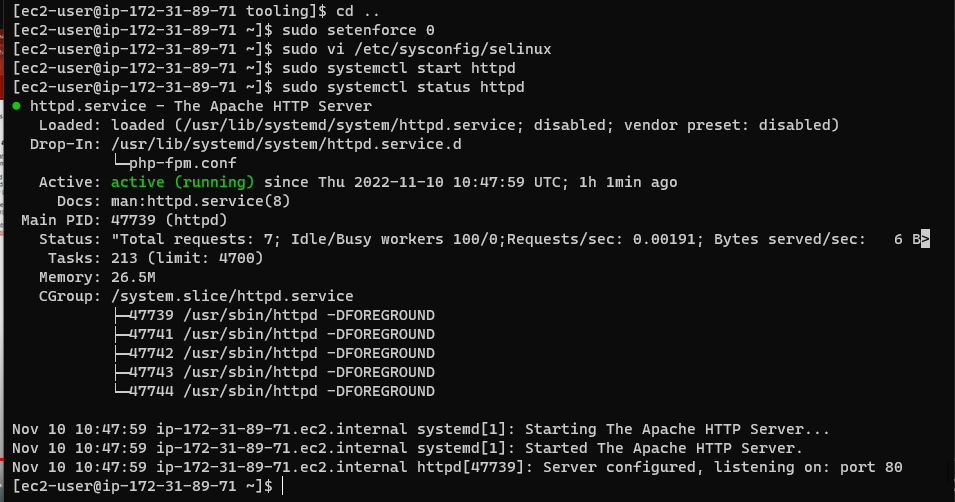

## Setup and technologies used in Project 7

As a member of a DevOps team, you will implement a tooling website solution which makes access to DevOps tools within the corporate infrastructure easily accessible.

In this project you will implement a solution that consists of following components:

1. Infrastructure: AWS
2. Webserver Linux: Red Hat Enterprise Linux 8
3. Database Server: Ubuntu 20.04 + MySQL
4. Storage Server: Red Hat Enterprise Linux 8 + NFS Server
5. Programming Language: PHP
6. Code Repository: GitHub


It is important to know what storage solution is suitable for what use cases, for this – you need to answer following questions: what data will be stored, in what format, how this data will be accessed, by whom, from where, how frequently, etc. Base on this you will be able to choose the right storage system for your solution.

## PREPARE NFS SERVER

Spin up a new EC2 instance with RHEL Linux 8 Operating System.


Based on your LVM experience from Project 6, Configure LVM on the Server.


Attach all three volumes one by one to your Web Server EC2 instance

Open up the Linux terminal to begin configuration

Use `lsblk` command to inspect what block devices are attached to the server.

`lsblk`


Use `df -h` command to see all mounts and free space on your server

`df -h`


Use `gdisk` utility to create a single partition on each of the 3 disks

`sudo gdisk /dev/xvdf`


Use `lsblk` utility to view the newly configured partition on each of the 3 disks

`lsblk`



Install `lvm2` package using `sudo yum install lvm2`

`sudo yum install lvm2`


Run `sudo lvmdiskscan` command to check for available partitions

`sudo lvmdiskscan`


**Note**: Previously, in Ubuntu we used apt command to install packages, in RedHat/CentOS a different package manager is used, so we shall use yum command instead.

Use `pvcreate` utility to mark each of 3 disks as physical volumes (PVs) to be used by LVM

```
sudo pvcreate /dev/xvdf1
sudo pvcreate /dev/xvdg1
sudo pvcreate /dev/xvdh1
```


Verify that your Physical volume has been created successfully by running `sudo pvs`

`sudo pvs`



Use vgcreate utility to add all 3 PVs to a volume group (VG). Name the VG **nfs-vg**

`sudo vgcreate nfs-vg /dev/xvdh1 /dev/xvdg1 /dev/xvdf1`


Verify that your VG has been created successfully by running `sudo vgs`

`sudo vgs`


Use lvcreate utility to create 3 logical volumes. opt-lv, apps-lv, and logs-lv. NOTE: apps-lv will be used to store data for the Website while, logs-lv will be used to store data for logs, and opt-lv will be used by Jenkins server in Project 8

```
sudo lvcreate -L 10G -n lv-apps nfs-vg 
sudo lvcreate -L 10G -n lv-opt nfs-vg
sudo lvcreate -L 5G -n lv-logs nfs-vg
```


Verify that your Logical Volume has been created successfully by running `sudo lvs`

`sudo lvs`


Verify the entire setup

`sudo vgdisplay -v #view complete setup - VG, PV, and LV`


`sudo lsblk`


Instead of formating the disks as `ext4` you will have to format them as `xfs`

Use `mkfs.ext4` to format the logical volumes with `xfs` filesystem

`sudo mkfs -t xfs /dev/nfs-vg/lv-opt`


`sudo mkfs -t xfs /dev/nfs-vg/lv-apps`


`sudo mkfs -t xfs /dev/nfs-vg/lv-logs`


Ensure there are 3 Logical Volumes. `lv-opt` `lv-apps`, and `lv-logs`

Create mount points on `/mnt` directory for the logical volumes as follow:

Mount `lv-apps` on `/mnt/apps` – To be used by webservers

Mount `lv-logs` on `/mnt/logs` – To be used by webserver logs

Mount `lv-opt` on `/mnt/opt` – To be used by Jenkins server in Project 8

Create **/mnt/apps**, **/mnt/logs**, **/mnt/opt** directory to store files

`sudo mkdir -p /mnt/apps`

`sudo mkdir -p /mnt/logs`

`sudo mkdir -p /mnt/opt`


`sudo mount /dev/nfs-vg/lv-apps /mnt/apps`

`sudo mount /dev/nfs-vg/lv-logs /mnt/logs`

`sudo mount /dev/nfs-vg/lv-opt /mnt/opt`


Install NFS server, configure it to start on reboot and make sure it is up and running

```
sudo yum -y update
sudo yum install nfs-utils -y
sudo systemctl start nfs-server.service
sudo systemctl enable nfs-server.service
sudo systemctl status nfs-server.service
```


Export the mounts for webservers’ subnet cidr to connect as clients. For simplicity, you will install your all three Web Servers inside the same subnet, but in production set up you would probably want to separate each tier inside its own subnet for higher level of security.
To check your subnet cidr – open your EC2 details in AWS web console and locate ‘Networking’ tab and open a Subnet link:

Make sure we set up permission that will allow our Web servers to read, write and execute files on NFS:

```
sudo chown -R nobody: /mnt/apps
sudo chown -R nobody: /mnt/logs
sudo chown -R nobody: /mnt/opt

sudo chmod -R 777 /mnt/apps
sudo chmod -R 777 /mnt/logs
sudo chmod -R 777 /mnt/opt

sudo systemctl restart nfs-server.service
```


Configure access to NFS for clients within the same subnet (example of Subnet CIDR – 172.31.32.0/20 ):

```
sudo vi /etc/exports

/mnt/apps <Subnet-CIDR>(rw,sync,no_all_squash,no_root_squash)
/mnt/logs <Subnet-CIDR>(rw,sync,no_all_squash,no_root_squash)
/mnt/opt <Subnet-CIDR>(rw,sync,no_all_squash,no_root_squash)

Esc + :wq!

sudo exportfs -arv
```


Check which port is used by NFS and open it using Security Groups (add new Inbound Rule)

`rpcinfo -p | grep nfs`


**Important note**: In order for NFS server to be accessible from your client, you must also open following ports: TCP 111, UDP 111, UDP 2049


## CONFIGURE THE DATABASE SERVER

By now you should know how to install and configure a MySQL DBMS to work with remote Web Server

Spin up a new EC2 instance with Ubuntu 20.04 Operating System.


Install MySQL server

```
sudo yum update
sudo yum install mysql-server
```


Create a database and name it *tooling*


Create a database user and name it *webaccess*

Grant permission to *webaccess* user on *tooling* database to do anything only from the webservers *subnet cidr*


## Prepare the Web Servers

We need to make sure that our Web Servers can serve the same content from shared storage solutions, in our case – NFS Server and MySQL database.
You already know that one DB can be accessed for *reads* and *writes* by multiple clients. For storing shared files that our Web Servers will use – we will utilize NFS and mount previously created Logical Volume *lv-apps* to the folder where Apache stores files to be served to the users (*/var/www*).

This approach will make our Web Servers *stateless*, which means we will be able to add new ones or remove them whenever we need, and the integrity of the data (in the database and on NFS) will be preserved.

During the next steps we will do following:

1. Configure NFS client (this step must be done on all three servers)
2. Deploy a Tooling application to our Web Servers into a shared NFS folder
3. Configure the Web Servers to work with a single MySQL database

Launch a new EC2 instance with RHEL 8 Operating System


Install NFS client

`sudo yum install nfs-utils nfs4-acl-tools -y`


Mount */var/www/* and target the NFS server’s export for apps

```
sudo mkdir /var/www
sudo mount -t nfs -o rw,nosuid <NFS-Server-Private-IP-Address>:/mnt/apps /var/www
```


Verify that NFS was mounted successfully by running *df -h*. Make sure that the changes will persist on Web Server after reboot:

`sudo vi /etc/fstab`

add following line

`<NFS-Server-Private-IP-Address>:/mnt/apps /var/www nfs defaults 0 0`


Install *Remi’s repository*, Apache and PHP

```s
sudo yum install httpd -y

sudo dnf install https://dl.fedoraproject.org/pub/epel/epel-release-latest-8.noarch.rpm

sudo dnf install dnf-utils http://rpms.remirepo.net/enterprise/remi-release-8.rpm

sudo dnf module reset php

sudo dnf module enable php:remi-7.4

sudo dnf install php php-opcache php-gd php-curl php-mysqlnd

sudo systemctl start php-fpm

sudo systemctl enable php-fpm

setsebool -P httpd_execmem 1
```


## Repeat steps 1-5 for another 2 Web Servers

Verify that Apache files and directories are available on the Web Server in */var/www* and also on the NFS server in */mnt/apps*. If you see the same files – it means NFS is mounted correctly. You can try to create a new file *touch test.txt* from one server and check if the same file is accessible from other Web Servers.


Locate the log folder for Apache on the Web Server and mount it to NFS server’s export for logs. Repeat step №4 to make sure the mount point will persist after reboot.


`sudo vi /etc/fstab`

add following line(for all web servers)

`<NFS-Server-Private-IP-Address>:/mnt/apps /var/www nfs defaults 0 0`

Fork the tooling source code from *Darey.io Github Account* to your Github account. 


Deploy the tooling website’s code to the Webserver. Ensure that the html folder from the repository is deployed to */var/www/html*


**Note 1**: Do not forget to open TCP port 80 on the Web Server.

**Note 2**: If you encounter 403 Error – check permissions to your */var/www/html* folder and also disable SELinux `sudo setenforce 0`
To make this change permanent – open following config file `sudo vi /etc/sysconfig/selinux` and set `SELINUX=disabled` then restart httpd.



Update the website’s configuration to connect to the database (in `/var/www/html/functions.php file`). Apply `tooling-db.sql` script to your database using this command `mysql -h <databse-private-ip> -u <db-username> -p <db-pasword> < tooling-db.sql`


Create in MySQL a new admin user with username: *myuser* and password: *password*

```sql
INSERT INTO ‘users’ (‘id’, ‘username’, ‘password’, ’email’, ‘user_type’, ‘status’) VALUES
-> (1, ‘myuser’, ‘5f4dcc3b5aa765d61d8327deb882cf99’, ‘user@mail.com’, ‘admin’, ‘1’);
```


Open the website in your browser `http://<Web-Server-Public-IP-Address-or-Public-DNS-Name>/index.php` and make sure you can login into the websute with `myuser` user.


# Congratulations.
